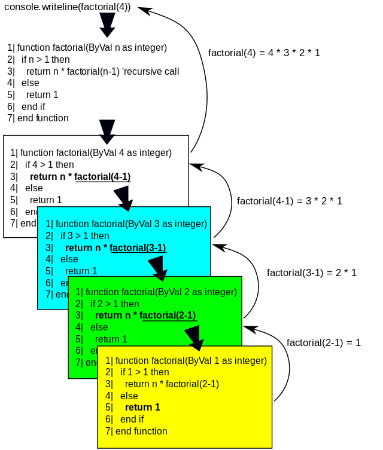

Factorials are one of the most fundamental concepts in mathematics and computer science. The factorial of a non-negative integer $n$, written as $n!$, is the product of all positive integers from $1$ to $n$:

$$
n! = n \times (n-1) \times (n-2) \times \cdots \times 2 \times 1
$$

By definition, $0! = 1$.

---

### Where Do Factorials Appear?

Factorials are everywhere! They are used in:

- **Combinatorics:** Counting arrangements (permutations) and selections (combinations).
- **Algebra:** Binomial coefficients and polynomial expansions.
- **Calculus:** Taylor series expansions and derivatives.
- **Probability:** Counting possible outcomes and arrangements.
- **Computer Science:** Algorithm analysis and recursion.

 <small>Visualization: Recursive computation of factorial (factorial(4) breakdown)</small>

The image above shows how the factorial function can be computed recursively. Each call to <code>factorial(n)</code> breaks the problem into a smaller subproblem, until the base case is reached.

---

### Why Are Factorials Important in Problem Solving?

Factorials grow very quickly! For example:

\[
1! = 1 \\
2! = 2 \\
3! = 6 \\
4! = 24 \\
5! = 120 \\
10! = 3,628,800
\]

This rapid growth means that for even moderately large $n$, $n!$ becomes too large to store in standard data types. This leads to interesting computational challenges.

---

### Key Problems Involving Factorials

### 1. Counting the Number of Digits in $n!$

**Problem:** Given a positive integer $n$, find the number of digits in $n!$.

**Why is this hard?**

- For large $n$, $n!$ cannot be computed or stored directly.
- We need a mathematical shortcut!

**Mathematical Insight:**

The number of digits in $n!$ is $\lfloor \log_{10}(n!) \rfloor + 1$.

Using properties of logarithms:

$$
\log_{10}(n!) = \log_{10}(1) + \log_{10}(2) + \cdots + \log_{10}(n)
$$

So, sum the logarithms of all numbers from $1$ to $n$, take the floor, and add $1$.

**Sample Input/Output:**

Input: 5  
Output: 3  
Input: 52  
Output: 68

---

### 2. Counting Trailing Zeroes in $n!$

**Problem:** Find the number of zeroes at the end of $n!$.

**Why do zeroes appear?**

Every time you multiply by 10, you add a trailing zero. Since $10 = 2 \times 5$, count how many times $n!$ contains pairs of 2 and 5. There are always more 2s than 5s, so count the number of 5s in the factorization of $n!$.

**Formula:**

$$
	ext{Number of trailing zeroes} = \left\lfloor \frac{n}{5} \right\rfloor + \left\lfloor \frac{n}{25} \right\rfloor + \left\lfloor \frac{n}{125} \right\rfloor + \cdots
$$

Keep dividing $n$ by 5, 25, 125, etc., and sum the quotients.

**Sample Input/Output:**

Input: 5  
Output: 1  
Input: 25  
Output: 6

---

### Computational Challenges

- For large $n$, direct computation is impossible due to storage and time limits.
- Use mathematical properties (logarithms, factorization) to solve problems efficiently.

---

### Summary

Factorials are a gateway to deeper mathematical thinking and efficient algorithm design. By understanding their properties and computational challenges, you can solve a wide range of problems in mathematics, computer science, and beyond.

---

_This experiment encourages you to implement algorithms for factorial-based problems, deepening your understanding of mathematics and programming._
